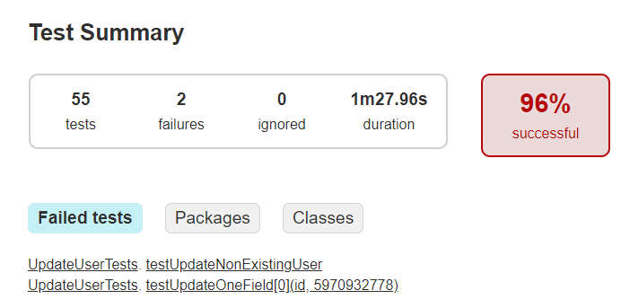
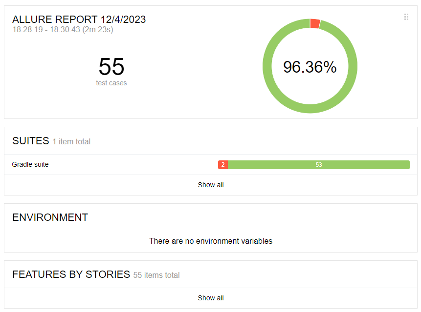

[](https://github.com/Polmik/test_task_pet_store/actions/workflows/gradle.yml)

### Overview

Проект представляет из себя тестовое решение для тестирования сервиса https://petstore.swagger.io с использованием библиотеки RestAssured.

Для дополнительной отчетности решение позволяет получить Allure отчет.

### Environment requirements

* Java JDK19
* Gradle 8.2

### Build and Testing using Gradle

Для запуска тестов достаточно выполнить команду:
```bash
gradle clean test
```

### How to Run Docker
Решение поддерживает запуск тестов в подготовленном контейнере с использованием docker-compose.

Подготовить базовый контейнер, описанный в Dockerfile

```bash
docker build -t my-test-container .
```

### Testing via Docker

В текущей реализации добавлена поддержка следующих сервисов:
* web:ngix - для отображения результатов отчета
* test:my-test-container - базовый контейнер, необходимый для запуска тестов


Тесты можно легко обновлять или добавлять: просто добавьте классы Java или внесите любые изменения в кодовую базу, запустите тестовый контейнер еще раз.

1. Развертывание сервисов, необходимых для тестирования

```bash
docker-compose up -d
```

2. Запуск тестов

```bash
docker-compose start test
```

### View results

1. Просмотр результатов лога

```bash
docker-compose logs -f
```

Лог предоставляется в следующем формате:
```commandline
Gradle suite > Gradle test > tests.users.UpdateUserTests > testUpdateOneField[5](phone, 88888888) STANDARD_OUT
2023-12-04 11:35:15     [2023-12-04 08:35:15] [INFO ] - -------------------------------------------------------------------------------------------------------
2023-12-04 11:35:15     [2023-12-04 08:35:15] [INFO ] - =====================  Test case: : 'tests.users.UpdateUserTests' =====================
2023-12-04 11:35:15     [2023-12-04 08:35:15] [INFO ] - -------------------------------------------------------------------------------------------------------
2023-12-04 11:35:15     [2023-12-04 08:35:15] [INFO ] - ---------------------------------------==[ Step: Creating and getting the User ]==------------------------------------------
2023-12-04 11:35:15     [2023-12-04 08:35:15] [INFO ] - Sending "https://petstore.swagger.io/v2/user" POST request with body:
2023-12-04 11:35:15     {
2023-12-04 11:35:15         "firstName": "TxJjIDKgeo",
2023-12-04 11:35:15         "lastName": "ZVgZGYgstF",
2023-12-04 11:35:15         "password": "jtXITb8La8",
2023-12-04 11:35:15         "userStatus": 7,
2023-12-04 11:35:15         "phone": "5381302482",
2023-12-04 11:35:15         "id": 7830231199,
2023-12-04 11:35:15         "email": "hOrYDBlvgL@email.com",
2023-12-04 11:35:15         "username": "ycXZFeoArv"
2023-12-04 11:35:15     }
2023-12-04 11:35:16     [2023-12-04 08:35:16] [INFO ] - Response:
2023-12-04 11:35:16     {
2023-12-04 11:35:16         "code": 200,
2023-12-04 11:35:16         "type": "unknown",
2023-12-04 11:35:16         "message": "7830231199"
2023-12-04 11:35:16     }
```

2. Посмотреть XML отчет

```commandline
http://localhost:3000
```



3. Посмотреть Allure отчет

```commandline
http://localhost:3001
```


